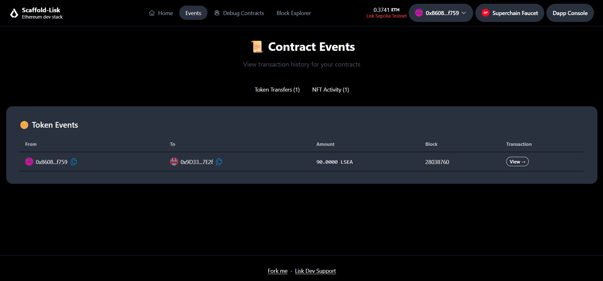

<div align="center">
  <a href="https://lisk.com"></a>
</div>

<h1 align="center">Scaffold-Lisk</h1>

<div align="center">
  <a href="https://github.com/LiskHQ/scaffold-lisk/blob/main/LICENCE">
    
  </a>
  <a href="https://github.com/LiskHQ/scaffold-lisk/actions/workflows/lint.yaml">
    
  </a>
</div>

<br />

**Scaffold-Lisk** is a fork of Scaffold-OP with minimal differences, providing additional dApp examples, native support for Superchain testnets, and more low-level instructions. We highly recommend the Scaffold-ETH2 docs as the primary guideline.

## 🚀 Deployed Project

| Item | Link / Address |
| --- | --- |
| **Frontend URL** | [https://w3-lisk-speedrun-nextjs.vercel.app/events](https://w3-lisk-speedrun-nextjs.vercel.app/events) |
| **MyToken Contract** | `0xF775fb246c220Cb43Bb7E89b5dCf54371A7aed9f` |
| **MyNFT Contract** | `0x46Ac8d13370C075C329FF6b960895F90f2042ee4` |

## 📸 Screenshots

### Events Page



<div align="center" style="margin-top: 24px;">
  
</div>

## ✨ Features

- ✅ **Contract Hot Reload**: Your frontend auto-adapts to your smart contract as you edit it.
- 🪝 **[Custom hooks](https://docs.scaffoldeth.io/hooks/)**: Collection of React hooks wrapper around [wagmi](https://wagmi.sh/) to simplify interactions with smart contracts with typescript autocompletion.
- 🧱 [**Components**](https://docs.scaffoldeth.io/components/): Collection of common web3 components to quickly build your frontend.
- 🔥 **Burner Wallet & Local Faucet**: Quickly test your application with a burner wallet and local faucet.
- 🔐 **Integration with Wallet Providers**: Connect to different wallet providers and interact with the Ethereum network.

## 🛠️ Requirements

- [Node (>= v18.17)](https://nodejs.org/en/download/)
- Yarn ([v1](https://classic.yarnpkg.com/en/docs/install/) or [v2+](https://yarnpkg.com/getting-started/install))
- [Git](https://git-scm.com/downloads)

## 🏁 Quickstart

<details>
<summary>Click to expand</summary>

1.  **Clone this repo & install dependencies**

    ```bash
    git clone https://github.com/LiskHQ/scaffold-lisk.git
    cd scaffold-lisk
    yarn install
    ```

2.  **Run a local network in the first terminal**

    ```bash
    yarn chain
    ```

    This command starts a local Ethereum network using Hardhat. The network runs on your local machine and can be used for testing and development. You can customize the network configuration in `hardhat.config.ts`.

3.  **On a second terminal, deploy the test contract**

    ```bash
    yarn deploy
    ```

    This command deploys a test smart contract to the local network. The contract is located in `packages/hardhat/contracts` and can be modified to suit your needs. The `yarn deploy` command uses the deploy script located in `packages/hardhat/deploy` to deploy the contract to the network. You can also customize the deploy script.

4.  **On the same terminal, start your NextJS app**

    ```bash
    yarn start
    ```

    Visit your app on: `http://localhost:3000`. You can interact with your smart contract using the `Debug Contracts` page. You can tweak the app config in `packages/nextjs/scaffold.config.ts`.

</details>

## 🚢 Deploy Contracts to Superchain Testnet(s)

<details>
<summary>Click to expand</summary>

1.  Get Superchain Sepolia ETH from the [Superchain Faucet](https://app.optimism.io/faucet)

2.  Inside the `packages/hardhat` directory, copy `.env.example` to `.env`.

    ```bash
    cd packages/hardhat && cp .env.example .env
    ```

3.  Edit your `.env` to specify the environment variables. Only specifying the `DEPLOYER_PRIVATE_KEY` is necessary here. The contract will be deployed from the address associated with this private key, so make sure it has enough Sepolia ETH.

    ```bash
    DEPLOYER_PRIVATE_KEY = "your_private_key_with_sepolia_ETH";
    ```

4.  Inside `scaffold-lisk`, run

    ```bash
    yarn deploy --network-options
    ```

    Use spacebar to make your selection(s). This command deploys all smart contracts in `packages/hardhat/contracts` to the selected network(s). Alternatively, you can try

    ```bash
    yarn deploy --network networkName
    ```

    Network names are found in `hardhat.config.js`. Please ensure you have enough Sepolia ETH on all these Superchains. If the deployments are successful, you will see the deployment tx hash on the terminal.

</details>

## 📚 Documentation

We highly recommend visiting the original [docs](https://docs.scaffoldeth.io) to learn how to start building with Scaffold-ETH 2.

To know more about its features, check out their [website](https://scaffoldeth.io).